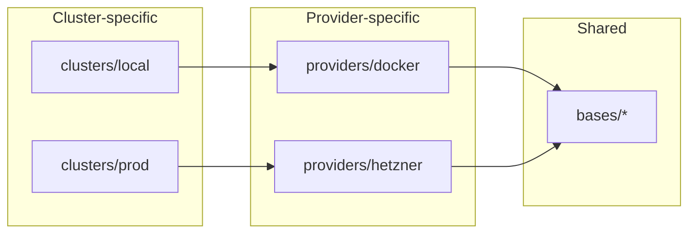
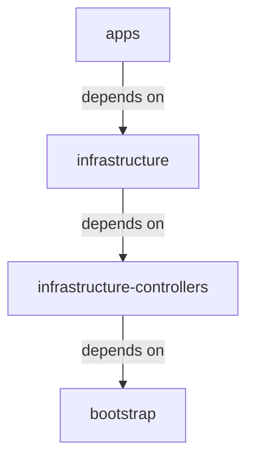

# Platform Template ☸️⛴️

> **A GitHub template.** Click **“Use this template”**, set a handful of GitHub
> Variables + Secrets, install one GitHub App, and run the **Bootstrap** workflow —
> it provisions a complete, batteries-included Kubernetes platform on Hetzner Cloud
> for you, unattended. This repository is a genericized, fully-automated-bootstrap
> version of [`devantler-tech/platform`](https://github.com/devantler-tech/platform),
> from which it is derived.

This template gives you an opinionated Kubernetes platform managed end-to-end with
**Flux GitOps**, **[KSail](https://github.com/devantler-tech/ksail)**, and **Talos
Linux**. It runs locally on Docker for development and in production on Hetzner
Cloud, and every change is validated in CI before it reaches the cluster. Use it as
a starting point for your own homelab or small-team platform — instantiate it, point
it at your accounts, and you have a production-grade cluster with networking,
certificates, secrets management, SSO, policy/runtime security, storage, databases,
observability, backups, and autoscaling already wired together.

- **Bootstrap once, unattended** → [`docs/BOOTSTRAP.md`](docs/BOOTSTRAP.md).
- **Develop locally on Docker** → [Local development](#local-development).
- **Customize the inputs** → [`docs/TEMPLATING.md`](docs/TEMPLATING.md).

## What you get

A high-level inventory of what Flux reconciles onto the cluster. The manifests live
under [`k8s/bases/infrastructure/`](k8s/bases/infrastructure) and
[`k8s/bases/apps/`](k8s/bases/apps), with provider-specific pieces (Hetzner CCM/CSI,
Longhorn, external-dns, …) under [`k8s/providers/`](k8s/providers). The exact set is
overlay-dependent: local/CI (Docker) deploys the full base set, while the
Hetzner/prod overlay opts out of a few controllers to save resources (noted inline).

**Infrastructure**

- **GitOps & config** — Flux Operator, Reloader
- **Networking** — Cilium (CNI + Gateway API), CoreDNS, external-dns (Cloudflare), Hetzner CCM (prod)
- **Certificates** — cert-manager, trust-manager, Cloudflare Origin CA issuer
- **Secrets** — OpenBao + External Secrets Operator (runtime), SOPS + Age (at-rest seeds); see [`docs/secret-rotation.md`](docs/secret-rotation.md)
- **Identity / SSO** — Dex (OIDC) with oauth2-proxy / auth-proxy; see [`docs/oidc-kubectl.md`](docs/oidc-kubectl.md)
- **Policy & runtime security** — Kyverno (admission policy), Kubescape (posture + runtime detection), Tetragon (runtime enforcement); see [`docs/runtime-security.md`](docs/runtime-security.md)
- **Storage** — Longhorn (replicated block / RWX, prod via Hetzner CSI), CloudNativePG (PostgreSQL operator); see [`docs/rwx-storage.md`](docs/rwx-storage.md)
- **Autoscaling** — Cluster Autoscaler (nodes), Vertical Pod Autoscaler, KEDA + KEDA HTTP add-on; see [`docs/node-autoscaling.md`](docs/node-autoscaling.md)
- **Observability** — kube-prometheus-stack (Prometheus, Grafana, Alertmanager), Loki (logs), Grafana Alloy (collection), OpenCost (cost)
- **Backup / DR** — Velero with CloudNativePG backups to S3-compatible storage (Cloudflare R2 in prod); see [`docs/dr/`](docs/dr)
- **Virtualization** — KubeVirt + CDI _(local/CI only; disabled on the Hetzner/prod overlay)_
- **Testing** — Testkube _(local/CI only; not deployed to prod)_

**Demo apps** ([`k8s/bases/apps/`](k8s/bases/apps))

- **Homepage** — a dashboard landing page for the platform
- **Headlamp** — a Kubernetes web UI
- **whoami** — a tiny debug echo service

These are intentionally lightweight so the platform stands up with something to look
at. To run **your own** application on the platform, add it as a GitOps **tenant**
from its own repository — see [`docs/TENANTS.md`](docs/TENANTS.md).

## Quick start

The headline feature of this template is the **[Bootstrap workflow](.github/workflows/bootstrap.yaml)**:
it takes a fresh instance from “Use this template + GitHub config” all the way to a
running Hetzner cluster, fully unattended.

1. **Use this template.** Click **“Use this template” → “Create a new repository”**
   on GitHub to create your own instance. (The Bootstrap workflow is guarded so it
   only runs in instances, never in the template repo itself.)

2. **Install a GitHub App on your new repo.** The bootstrap writes cluster-derived
   credentials back as `prod` environment secrets, which the default `GITHUB_TOKEN`
   is **not** allowed to do. So you must install a GitHub App (or use a fine-grained
   PAT) granted **Contents: write, Secrets: write, Environments: write, Actions:
   write**. You provide its `APP_ID` (Variable) and `APP_PRIVATE_KEY` (Secret).
   Full instructions: [`docs/BOOTSTRAP.md`](docs/BOOTSTRAP.md#1-install-the-bootstrap-github-app).

   > So the real one-time setup is **“GitHub config + one GitHub App install”** —
   > not literally only secrets.

3. **Set the Variables + Secrets.** Add the non-secret **Variables** (`DOMAIN`,
   `CLOUDFLARE_ZONE`, `ADMIN_EMAIL`, `HETZNER_LOCATION`, …) and the **Secrets**
   (`HCLOUD_TOKEN`, `CLOUDFLARE_API_TOKEN`, …) in your repository settings. The
   complete tables, with what each value is and where to get it, are in
   [`docs/BOOTSTRAP.md`](docs/BOOTSTRAP.md#configuration). A few cluster secrets
   (`SOPS_AGE_KEY`, `KUBE_CONFIG`, `TALOS_CONFIG`) are **auto-generated** by the
   bootstrap — you never set those.

4. **Run the Bootstrap workflow.** Actions → **🌱 Bootstrap** → *Run workflow*,
   choose `prod`, and type `yes` to confirm. It generates an Age key, renders your
   config, encrypts your secrets, provisions the Talos cluster on Hetzner via
   `ksail cluster create`, persists the cluster credentials back as `prod`
   environment secrets, points Cloudflare DNS at the new load balancer, and commits
   the rendered + encrypted tree back to your repo.

5. **Done.** DNS and the cluster are live. From here on, the steady-state pipelines
   own the cluster: open PRs (validated + system-tested in CI) and merge them to
   deploy via the merge queue, or push a `v*` tag to deploy via the CD pipeline.

See the authoritative, step-by-step guide — including prerequisites, verification,
teardown, and troubleshooting — in **[`docs/BOOTSTRAP.md`](docs/BOOTSTRAP.md)**.

## Local development

You do **not** need Hetzner or the Bootstrap workflow to develop locally. The local
cluster runs entirely on Docker via KSail, using Talos with the Docker provider.

**Prerequisites:** [Docker](https://docs.docker.com/get-docker/) and
[KSail](https://github.com/devantler-tech/ksail).

```bash
ksail cluster create
ksail workload push
ksail workload reconcile
```

Ports 80 and 443 are automatically mapped to localhost via `extraPortMappings` in
[`ksail.yaml`](ksail.yaml). Once the cluster is running, access services at
`https://platform.lan` (and `https://<service>.platform.lan`) — this requires the
host entries from the [`hosts`](hosts) file. Local TLS is signed by a self-signed CA
that cert-manager generates automatically, so trust the cluster CA (or your mkcert
root) in your system store to avoid certificate warnings.

To validate manifests before pushing — faster than a full cluster test:

```bash
ksail workload validate                          # local cluster (default)
ksail --config ksail.prod.yaml workload validate # prod cluster manifests
```

To tear down:

```bash
ksail cluster delete
```

> **Note on secrets locally.** A fresh template carries placeholder `*.enc.yaml`
> files that are not yet encrypted to a real key. For pure local development you can
> generate your own Age key, wire its public half into [`.sops.yaml`](.sops.yaml),
> and `sops -e` the seed secrets — or simply run the Bootstrap workflow with the
> `local` environment. See [`docs/TEMPLATING.md`](docs/TEMPLATING.md) and
> [`docs/secret-rotation.md`](docs/secret-rotation.md).

## Clusters

> [!TIP]
> All clusters allow scheduling of workloads on control-plane nodes. For homelab
> purposes this is fine; for enterprise use, separate control-plane and worker
> nodes for high availability.

### Local

Local development cluster running on Docker via KSail. Uses Talos with the Docker
provider.

- 1 control-plane node + 3 worker nodes (Docker containers)
- Config: [`ksail.yaml`](ksail.yaml)

### Production

Cloud cluster running on Hetzner Cloud via KSail’s native Hetzner provider, which
handles Talos boot, the Hetzner CCM/CSI, and the kubeconfig. Provisioned once by the
**Bootstrap** workflow (`ksail cluster create`); thereafter deployed via `v*` tags
through the CD pipeline and validated in the merge queue by the CI pipeline
(`ksail cluster update`).

- 3× Hetzner control planes + static workers + Cluster Autoscaler, fronted by a
  managed Hetzner Cloud Load Balancer
- Config: [`ksail.prod.yaml`](ksail.prod.yaml)

## How it runs: bootstrap vs. steady state

| Phase | Trigger | KSail verb | Owns |
|---|---|---|---|
| **Bootstrap** | [`bootstrap.yaml`](.github/workflows/bootstrap.yaml), run once manually | `ksail cluster create` | First provisioning of the cluster + credential write-back |
| **Steady state — validate/deploy** | `ci.yaml` (PR validate + ephemeral Docker system test + merge-queue deploy) | `ksail cluster update` (idempotent) | Day-to-day changes via PRs |
| **Steady state — release** | `cd.yaml` on a `v*` tag | `ksail cluster update` (idempotent) | Tagged releases to prod |

Bootstrap is **`cluster create`** (a genuine first-provisioning primitive that errors
if the cluster already exists). Steady state is **`cluster update`** (idempotent
drift reconciliation). After bootstrap, you never run it again unless you tear the
cluster down — see [`docs/BOOTSTRAP.md`](docs/BOOTSTRAP.md#teardown).

## Structure

The cluster uses Flux GitOps to reconcile cluster state from the single source of
truth in this repository, published as an OCI image. KSail is used for local
development, CI/CD testing, and production deployments. All environments use the
Talos Kubernetes distribution — local/CI on the Docker provider, prod on the Hetzner
provider.

The cluster configuration lives under `k8s/*`:

- [`clusters/`](k8s/clusters) — cluster-specific configuration per environment.
  - [`base`](k8s/clusters/base) — shared Flux Kustomizations with sentinel paths (`__CLUSTER__`, `__PROVIDER__`).
  - [`local`](k8s/clusters/local) — local cluster overlay.
  - [`prod`](k8s/clusters/prod) — production cluster overlay.
- [`providers/`](k8s/providers) — provider-specific configuration.
  - [`docker`](k8s/providers/docker) — Talos + Docker (local development).
  - [`hetzner`](k8s/providers/hetzner) — Talos + Hetzner (production).
- [`bases/`](k8s/bases) — shared bases used across clusters and providers.
  - [`infrastructure`](k8s/bases/infrastructure) — infrastructure components.
  - [`apps`](k8s/bases/apps) — the demo applications.
  - [`bootstrap`](k8s/bases/bootstrap) — the foundational **bootstrap layer**: shared substitution variables (`variables-base` ConfigMap + SOPS-encrypted Secret) and cluster-scoped PriorityClasses, reconciled by the `bootstrap` Flux Kustomization before everything that `dependsOn` it.

### Kustomize overlay flow

Each cluster environment references a provider overlay, which patches the shared base
resources:



### Flux Kustomization dependency chain

Flux Kustomizations reconcile sequentially; each layer waits for the previous to
become ready:



The Flux Kustomizations live in [`k8s/clusters/base/`](k8s/clusters/base) with
sentinel `__CLUSTER__` / `__PROVIDER__` values in `spec.path`. Each
`k8s/clusters/<cluster>/` overlay patches the `cluster-meta` ConfigMap with its
`cluster_name` / `provider` and uses kustomize `replacements:` to rewrite those
sentinels. Only the per-cluster `bootstrap/` directory holds cluster-specific
manifests. See [`docs/TEMPLATING.md`](docs/TEMPLATING.md) for the exact set of inputs
a new instance customizes.

## Documentation

Deeper guides and design notes live in [`docs/`](docs):

- [`BOOTSTRAP.md`](docs/BOOTSTRAP.md) — the authoritative end-to-end bootstrap guide (prerequisites, Variables/Secrets, run, verify, teardown, troubleshooting).
- [`TEMPLATING.md`](docs/TEMPLATING.md) — the template inputs the bootstrap renders, and how to change them post-bootstrap or for a new environment.
- [`TENANTS.md`](docs/TENANTS.md) — onboarding a GitOps tenant (an app that runs on the platform from its own repository).
- [`secret-rotation.md`](docs/secret-rotation.md) — the secrets architecture (SOPS → OpenBao → External Secrets) and rotation design.
- [`node-autoscaling.md`](docs/node-autoscaling.md) — how the Cluster Autoscaler is configured on Hetzner.
- [`oidc-kubectl.md`](docs/oidc-kubectl.md) — authenticating `kubectl` against the cluster via OIDC.
- [`runtime-security.md`](docs/runtime-security.md) — runtime security (Kubescape detection + Tetragon enforcement).
- [`rwx-storage.md`](docs/rwx-storage.md) — Longhorn replicated / RWX storage.
- [`dr/`](docs/dr) — disaster-recovery runbooks (backup/restore drills, OpenBao crypto custody, Velero + CloudNativePG, alerting).

## Credits

Derived from [`devantler-tech/platform`](https://github.com/devantler-tech/platform),
built with [KSail](https://github.com/devantler-tech/ksail),
[Flux](https://fluxcd.io), [Talos Linux](https://www.talos.dev), and the open-source
projects listed above.

## License

See [`LICENSE`](LICENSE). Security policy: [`SECURITY.md`](SECURITY.md).
