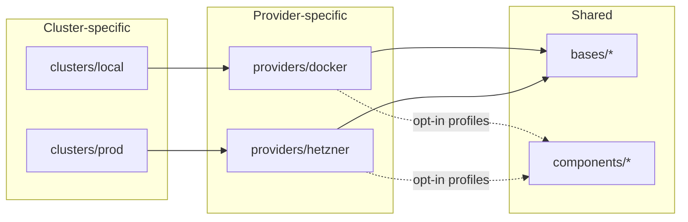
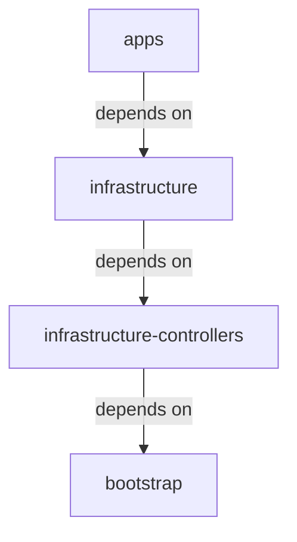

# Architecture

What an instance of this template runs, on which clusters, and how the repository is laid out. For
standing up an instance, start with [`BOOTSTRAP.md`](BOOTSTRAP.md); for the inputs an instance
changes, see [`TEMPLATING.md`](TEMPLATING.md).

## What runs on the cluster

Flux reconciles the manifests under [`k8s/bases/infrastructure/`](../k8s/bases/infrastructure) and
[`k8s/bases/apps/`](../k8s/bases/apps), with provider-specific pieces (Hetzner CCM/CSI, Longhorn,
external-dns, …) under [`k8s/providers/`](../k8s/providers). The exact set depends on the overlay:
local/CI (Docker) deploys the full base set, while the Hetzner/prod overlay leaves out a few
controllers to save resources (noted inline).

### Infrastructure

- **GitOps & config** — Flux Operator, Reloader
- **Networking** — Cilium (CNI + Gateway API), CoreDNS, external-dns (Cloudflare), Hetzner CCM (prod)
- **Certificates** — cert-manager, trust-manager, Cloudflare Origin CA issuer
- **Secrets** — OpenBao + External Secrets Operator (runtime), SOPS + Age (at-rest seeds); see [`secret-rotation.md`](secret-rotation.md)
- **Identity / SSO** — Dex (OIDC) with oauth2-proxy / auth-proxy; see [`oidc-kubectl.md`](oidc-kubectl.md)
- **Policy & runtime security** — Kyverno (admission policy), Kubescape (posture + runtime detection), Tetragon (runtime enforcement); see [`runtime-security.md`](runtime-security.md)
- **Storage** — Longhorn (replicated block / RWX, prod via Hetzner CSI), CloudNativePG (PostgreSQL operator); see [`rwx-storage.md`](rwx-storage.md)
- **Autoscaling** — Cluster Autoscaler (nodes), Vertical Pod Autoscaler, KEDA + KEDA HTTP add-on; see [`node-autoscaling.md`](node-autoscaling.md)
- **Observability** — kube-prometheus-stack (Prometheus, Grafana, Alertmanager),
  Loki (logs), Grafana Alloy (collection), and OpenCost (cost) by default; a
  [transitional Coroot profile](TEMPLATING.md#select-the-transitional-coroot-profile)
  is available as an explicit per-cluster opt-in
- **Backup / DR** — Velero with CloudNativePG backups to S3-compatible storage (Cloudflare R2 in prod); see [`dr/`](dr)
- **Virtualization** — KubeVirt + CDI _(local/CI only; disabled on the Hetzner/prod overlay)_
- **Testing** — Testkube _(local/CI only; not deployed to prod)_

### Demo apps

- **Homepage** — a dashboard landing page for the platform
- **Headlamp** — a Kubernetes web UI
- **whoami** — a tiny debug echo service

They are deliberately lightweight, so a new platform has something to look at. To run **your own**
application on the platform, add it as a GitOps **tenant** from its own repository — see
[`TENANTS.md`](TENANTS.md).

## Clusters

> [!TIP]
> All clusters allow scheduling of workloads on control-plane nodes. For homelab
> purposes this is fine; for enterprise use, separate control-plane and worker
> nodes for high availability.

### Local

Local development cluster running on Docker via KSail. Uses Talos with the Docker
provider.

- 1 control-plane node + 3 worker nodes (Docker containers)
- Config: [`ksail.yaml`](../ksail.yaml)

### Production

Cloud cluster running on Hetzner Cloud via KSail’s native Hetzner provider, which
handles Talos boot, the Hetzner CCM/CSI, and the kubeconfig. Provisioned once by the
**Bootstrap** workflow (`ksail cluster create`); thereafter deployed via `v*` tags
through the CD pipeline and validated in the merge queue by the CI pipeline
(`ksail cluster update`).

- 3× Hetzner control planes + static workers + Cluster Autoscaler, fronted by a
  managed Hetzner Cloud Load Balancer
- Config: [`ksail.prod.yaml`](../ksail.prod.yaml)

## How it runs: bootstrap vs. steady state

| Phase | Trigger | KSail verb | Owns |
|---|---|---|---|
| **Bootstrap** | [`bootstrap.yaml`](../.github/workflows/bootstrap.yaml), run once manually | `ksail cluster create` | First provisioning of the cluster + credential write-back |
| **Steady state — validate/deploy** | `ci.yaml` (PR validate + ephemeral Docker system test + merge-queue deploy) | `ksail cluster update` (idempotent) | Day-to-day changes via PRs |
| **Steady state — release** | `cd.yaml` on a `v*` tag | `ksail cluster update` (idempotent) | Tagged releases to prod |

Bootstrap is **`cluster create`** (a genuine first-provisioning primitive that errors
if the cluster already exists). Steady state is **`cluster update`** (idempotent
drift reconciliation). After bootstrap, you never run it again unless you tear the
cluster down — see [`BOOTSTRAP.md`](BOOTSTRAP.md#teardown).

## Repository layout

Flux reconciles the cluster from the single source of truth in this repository, published as an OCI
image. KSail is used for local development, CI/CD testing, and production deployments. All
environments use the Talos Kubernetes distribution — local/CI on the Docker provider, prod on the
Hetzner provider.

The cluster configuration lives under `k8s/*`:

- [`clusters/`](../k8s/clusters) — cluster-specific configuration per environment.
  - [`base`](../k8s/clusters/base) — shared Flux Kustomizations with sentinel paths (`__CLUSTER__`, `__PROVIDER__`).
  - [`local`](../k8s/clusters/local) — local cluster overlay.
  - [`prod`](../k8s/clusters/prod) — production cluster overlay.
- [`providers/`](../k8s/providers) — provider-specific configuration.
  - [`docker`](../k8s/providers/docker) — Talos + Docker (local development).
  - [`hetzner`](../k8s/providers/hetzner) — Talos + Hetzner (production).
- [`bases/`](../k8s/bases) — shared bases used across clusters and providers.
  - [`infrastructure`](../k8s/bases/infrastructure) — infrastructure components.
  - [`apps`](../k8s/bases/apps) — the demo applications.
  - [`bootstrap`](../k8s/bases/bootstrap) — the foundational **bootstrap layer**: shared substitution variables (`variables-base` ConfigMap + SOPS-encrypted Secret) and cluster-scoped PriorityClasses, reconciled by the `bootstrap` Flux Kustomization before everything that `dependsOn` it.
- [`components/`](../k8s/components) — shared opt-in Kustomize components. Only the opt-in provider
  profiles use them, to switch to [Coroot](TEMPLATING.md#select-the-transitional-coroot-profile) or
  add the [recommended-labels policy](TEMPLATING.md#add-recommended-workload-labels-at-admission);
  the default paths use none of them.

### Kustomize overlay flow

Each cluster environment references a provider overlay, which patches the shared base
resources. An opt-in profile points the cluster at a provider profile that also pulls in shared
components:

### Flux Kustomization dependency chain

Flux Kustomizations reconcile sequentially; each layer waits for the previous to
become ready:

The Flux Kustomizations live in [`k8s/clusters/base/`](../k8s/clusters/base) with
sentinel `__CLUSTER__` / `__PROVIDER__` values in `spec.path`. Each
`k8s/clusters/<cluster>/` overlay patches the `cluster-meta` ConfigMap with its
`cluster_name` / `provider` and uses kustomize `replacements:` to rewrite those
sentinels. Only the per-cluster `bootstrap/` directory holds cluster-specific
manifests. See [`TEMPLATING.md`](TEMPLATING.md) for the exact set of inputs a new
instance customizes.
